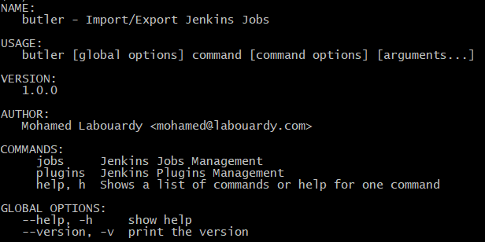

[](https://circleci.com/gh/mlabouardy/butler) [](LICENSE)

<div align="center">

</div>

CLI to import/export Jenkins jobs & plugins.

## Usage

<div align="center">

</div>

## Download

Below are the available downloads for the latest version of Butler (1.0.0). Please download the proper package for your operating system and architecture.

### Linux:

```
wget https://s3.us-east-1.amazonaws.com/butlercli/1.0.0/linux/butler
```

### Windows:

```
wget https://s3.us-east-1.amazonaws.com/butlercli/1.0.0/windows/butler
```

### Mac OS X:

```
wget https://s3.us-east-1.amazonaws.com/butlercli/1.0.0/osx/butler
```

### OpenBSD:

```
wget https://s3.us-east-1.amazonaws.com/butlercli/1.0.0/openbsd/butler
```

### FreeBSD:

```
wget https://s3.us-east-1.amazonaws.com/butlercli/1.0.0/freebsd/butler
```

## Installation

To install the library and command line program, use the following:

```
go get -u github.com/mlabouardy/butler
```

## Available Commands

### Jobs Management

```
$ butler jobs import --server localhost:8080 --username admin --password admin
```

```
$ butler jobs export --server localhost:8080 --username admin --password admin
```

### Plugins Management

```
$ butler plugins import --server localhost:8080 --username admin --password admin
```

```
$ butler plugins export --server localhost:8080 --username admin --password admin
```

## Tutorials

* [Butler CLI: Import/Export Jenkins Plugins & Jobs]()
